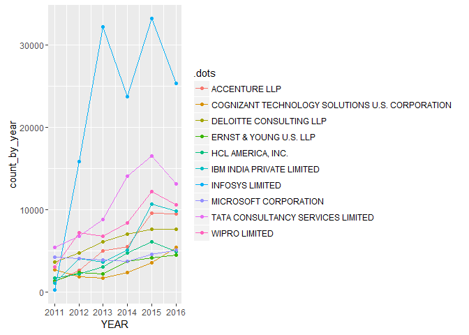

Which Employers file most number of petitions?
==============================================

    library(dplyr)

    ## Warning: package 'dplyr' was built under R version 3.3.1

    ## 
    ## Attaching package: 'dplyr'

    ## The following objects are masked from 'package:stats':
    ## 
    ##     filter, lag

    ## The following objects are masked from 'package:base':
    ## 
    ##     intersect, setdiff, setequal, union

    most_petitions <-
    h1b %>%
    group_by(EMPLOYER_NAME) %>%
    summarize(count=n()) %>%
    arrange(desc(count))

    most_petitions

    ## # A tibble: 236,015 x 2
    ##                                      EMPLOYER_NAME  count
    ##                                             <fctr>  <int>
    ## 1                                  INFOSYS LIMITED 130592
    ## 2                TATA CONSULTANCY SERVICES LIMITED  64726
    ## 3                                    WIPRO LIMITED  48117
    ## 4                          DELOITTE CONSULTING LLP  36742
    ## 5                        IBM INDIA PRIVATE LIMITED  34219
    ## 6                                    ACCENTURE LLP  33447
    ## 7                            MICROSOFT CORPORATION  25576
    ## 8                                HCL AMERICA, INC.  22678
    ## 9                           ERNST & YOUNG U.S. LLP  18232
    ## 10 COGNIZANT TECHNOLOGY SOLUTIONS U.S. CORPORATION  17528
    ## # ... with 236,005 more rows

Notes: We order the petitions filed by employers in descending order and
obtain the results as shown above. (Top 10 employers displayed)

For the top 10 employers, how has the petition filing varied over the years?
============================================================================

    top10 <- head(most_petitions,n=10)
    top10 <- inner_join(top10,h1b)

    ## Joining, by = "EMPLOYER_NAME"

    top10byyear <- 
    top10 %>%
    group_by(.dots=EMPLOYER_NAME,YEAR) %>%
    summarize(count_by_year=n()) 

    library(ggplot2)

    ## Warning: package 'ggplot2' was built under R version 3.3.1

    ggplot(top10byyear,aes(YEAR,count_by_year,group=.dots, color = .dots))+
    geom_point()+
    geom_line()

Notes: For the top sponsor Infosys, there has been a sharp drop in 2014,
a peak in 2015 and a drop in 2016. The top 3 employers, Infosys, TCS and
Wipro haven't filed as many petitions in 2016, as they have in 2015. For
most employers in this list, we observe a steady increase in the number
of petitions filed, till 2015, but a significant drop in 2016. Let us
look to see all the petitions filed over the years, to better understand
this drop.

    h1b %>%
      group_by(YEAR) %>%
      summarize(petitions_filed = n())

    ## # A tibble: 6 x 2
    ##    YEAR petitions_filed
    ##   <int>           <int>
    ## 1  2011          358767
    ## 2  2012          415607
    ## 3  2013          442114
    ## 4  2014          519427
    ## 5  2015          618727
    ## 6  2016          647803

Notes: Thus we can conclude that, in 2016, the no of petitions filed
weren't affected, but the ones by top companies, which are Indian,
reduced significantly. This can be attributed to the US Presidential
elections and the uncertainity surrounding H1B visas.

For top 10 employers, what percent of petitions got approved?
=============================================================

    top10Approved <- top10 %>%
    group_by(EMPLOYER_NAME) %>%
    summarize(percentApproved= (sum(CASE_STATUS == "CERTIFIED")/n())*100) 
    top10Approved

    ## # A tibble: 10 x 2
    ##                                      EMPLOYER_NAME percentApproved
    ##                                             <fctr>           <dbl>
    ## 1                                    ACCENTURE LLP        98.39746
    ## 2  COGNIZANT TECHNOLOGY SOLUTIONS U.S. CORPORATION        86.72980
    ## 3                          DELOITTE CONSULTING LLP        98.30711
    ## 4                           ERNST & YOUNG U.S. LLP        98.03642
    ## 5                                HCL AMERICA, INC.        98.04216
    ## 6                        IBM INDIA PRIVATE LIMITED        81.08069
    ## 7                                  INFOSYS LIMITED        99.48236
    ## 8                            MICROSOFT CORPORATION        87.32014
    ## 9                TATA CONSULTANCY SERVICES LIMITED        99.24451
    ## 10                                   WIPRO LIMITED        90.35476

What percent of total petitions are from top 10 employers?
==========================================================

    h1b %>%
    summarize(percent_top10 = sum(EMPLOYER_NAME %in% top10$EMPLOYER_NAME)/n()*100)

    ##   percent_top10
    ## 1      14.38351
